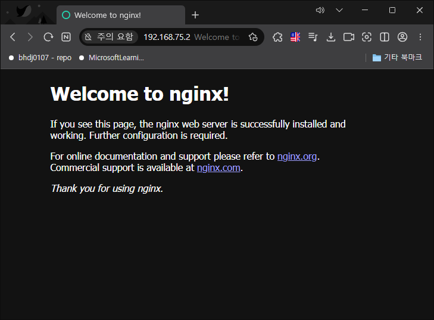

# nginx kubectl 에 배포해보기

1. kubectl create deploy nginx --image nginx

        (base) root@djlee:/home/djlee/projects/k8s/02_deploy_nginx# kubectl get all
        NAME                         READY   STATUS    RESTARTS   AGE
        pod/nginx-5869d7778c-jg65n   1/1     Running   0          15s

        NAME                 TYPE        CLUSTER-IP   EXTERNAL-IP   PORT(S)   AGE
        service/kubernetes   ClusterIP   10.96.0.1    <none>        443/TCP   36m

        NAME                    READY   UP-TO-DATE   AVAILABLE   AGE
        deployment.apps/nginx   1/1     1            1           15s

        NAME                               DESIRED   CURRENT   READY   AGE
        replicaset.apps/nginx-5869d7778c   1         1         1       15s

2. kubectl expose deploy nginx --type=LoadBalancer --port=8080 --target-port=80

        (base) root@djlee:/home/djlee/projects/k8s/02_deploy_nginx# kubectl get all
        NAME                         READY   STATUS    RESTARTS   AGE
        pod/nginx-5869d7778c-jg65n   1/1     Running   0          68s

        NAME                 TYPE           CLUSTER-IP     EXTERNAL-IP       PORT(S)          AGE
        service/kubernetes   ClusterIP      10.96.0.1      <none>            443/TCP          37m
        service/nginx        LoadBalancer   10.96.137.74   192.168.255.200   8080:32395/TCP   2s

        NAME                    READY   UP-TO-DATE   AVAILABLE   AGE
        deployment.apps/nginx   1/1     1            1           68s

        NAME                               DESIRED   CURRENT   READY   AGE
        replicaset.apps/nginx-5869d7778c   1         1         1       68s

3. kubectl port-forward --address=0.0.0.0 service/nginx 9080:8080

        (base) root@djlee:/home/djlee/projects/k8s/02_deploy_nginx# kubectl port-forward --address=0.0.0.0 service/nginx 9080:8080
        Forwarding from 0.0.0.0:9080 -> 80

    